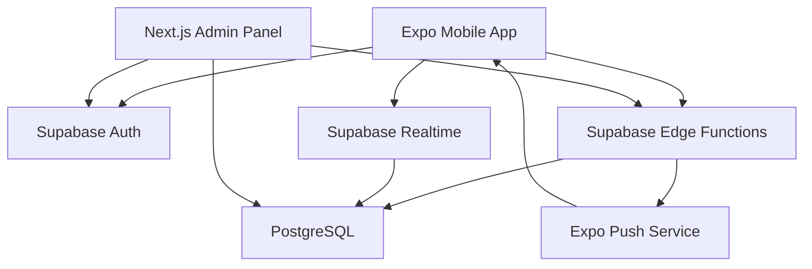

# Digital Leima / Student Pub Crawl App — Production V1 Master Plan

> **Amaç:** Bu doküman, AI ajanlarının projeyi geliştirirken sürekli referans alacağı ana teknik plan dosyasıdır.  
> **Yaklaşım:** MVP değil; düşük maliyetli ama production V1 kapsamı.  
> **Ana fikir:** Öğrenci kulüplerinin düzenlediği appro / pub crawl tarzı etkinliklerde fiziksel damga kartını dijitalleştirmek. Öğrenciler etkinlik boyunca anlaşmalı mekanlara gider, her mekanda dijital leima alır, yeterli leima toplayınca kulübün vaat ettiği ödülleri / haalarimerkki / patch / ürünleri claim eder.

---

## 0. Product Context

### 0.0 Product positioning

OmaLeima is positioned as a digital leima pass for Finnish student overalls events.

The product should not be presented as a generic QR stamp app or a generic bar app. It is the digital infrastructure for existing Finnish student event culture: haalarit, haalarimerkki, appro, pub crawl, baarikierros, guild events, ainejarjestot events, and student club parties.

Primary adoption target:

```txt
ainejarjestot, guilds, student clubs, student unions, and event organizers
```

Student users are the visible and viral side of the product, but the main operational customer is the organizer who manages venues, stamps, rewards, fraud prevention, and event-day logistics.

Core launch message:

```txt
Digital leima pass for Finnish student overalls events.
```

Product promise:

```txt
Run appro and student pub crawl events without paper stamp cards.
Students collect leimat with QR, unlock haalarimerkki / patches / rewards,
and organizers track the whole event securely.
```

### 0.1 Gerçek dünya akışı

Geleneksel sistem:

1. Öğrenci kulübü bir etkinlik düzenler.
2. Kulüp katılımcılara fiziksel kart verir.
3. Kartta örneğin 10, 15 veya 20 damga alanı olur.
4. Öğrenciler etkinliğe katılan mekanlara gider.
5. Mekan, öğrenci etkinlik için gereken ürünü / kontrolü tamamladıysa karta damga vurur.
6. Öğrenci yeterli damgayı tamamlayınca kulübün belirlediği ödülü alır:
   - haalarimerkki
   - patch
   - sponsor ürünü
   - kupon
   - afterparty girişi
   - özel rozet
   - leaderboard ödülü

Dijital sistem:

1. Öğrenci mobil uygulamada etkinliği görür.
2. Google ile giriş yapar.
3. Etkinlik için dinamik QR kod üretir.
4. Mekan uygulaması QR kodu tarar.
5. Backend QR'ı doğrular.
6. Sistem aynı öğrencinin aynı mekandan aynı etkinlikte yalnızca 1 leima almasını garanti eder.
7. Öğrenci canlı olarak kaç leima topladığını, sıralamasını ve ödül durumunu görür.
8. Öğrenci tamamlayınca ödül claim ekranı açılır.
9. Kulüp yetkilisi öğrencinin ödülünü teslim eder ve sistemde işaretler.

---

## 1. Core Product Principles

### 1.1 Değişmez kurallar

Bu kurallar sistemin her katmanında korunmalıdır:

```txt
1 student + 1 event + 1 venue = maksimum 1 leima
```

```txt
QR kod kısa ömürlüdür ve tekrar kullanılamaz.
```

```txt
Mekanlar etkinlik başladıktan sonra etkinliğe katılamaz.
```

```txt
Leima yalnızca etkinlik aktifken verilebilir.
```

```txt
Business hesabı kendi kendine tam yetki alamaz; başvuru + onay gerekir.
```

```txt
Ödül yalnızca yeterli leima toplayan öğrenciye bir kez verilebilir.
```

---

## 2. Recommended Low-Cost Production Architecture

### 2.1 Güncellenmiş teknoloji önerisi

En düşük maliyet ve en az operasyon yükü için ilk production V1 mimarisi:

| Katman | Seçim | Neden |
|---|---|---|
| Mobile App | React Native Expo | Tek kod tabanı, iOS + Android, hızlı geliştirme |
| Native build | EAS Development Build + EAS Build | Expo Go yerine production-grade native build |
| Backend Core | Supabase | Auth, PostgreSQL, Realtime, Edge Functions aynı yerde |
| Database | Supabase PostgreSQL | Transaction, unique constraint, relational model |
| Auth | Supabase Auth + Google Sign-In | Firebase ayrı servis maliyetini ve karmaşıklığını azaltır |
| Realtime | Supabase Realtime | Başlangıçta ayrı WebSocket sunucusu gerekmez |
| Server-side logic | Supabase Edge Functions + PostgreSQL RPC | QR signing, scan validation, notification jobs |
| Push notifications | Expo Notifications / Expo Push Service | Expo app ile düşük maliyetli ve pratik |
| Admin panel | Next.js | Web admin için hızlı ve ucuz |
| Admin hosting | Vercel / Cloudflare Pages / Netlify | Başlangıçta ücretsiz veya çok düşük maliyet |
| Monitoring | Sentry free tier veya self-host later | Crash/error takibi |
| Analytics | PostHog free/self-host optional | Ürün analitiği |
| Payments | V1'de yok | Maliyet ve regülasyon karmaşıklığını azaltır |

### 2.2 Neden NestJS'i ilk sürümde kullanmıyoruz?

İlk plan NestJS + PostgreSQL + Redis + Firebase idi. Teknik olarak güçlüdür; ama maliyet ve operasyon yükü artar:

- ayrı backend deploy
- ayrı Redis
- Firebase + Postgres + backend yönetimi
- WebSocket scaling
- daha fazla CI/CD
- daha fazla secret/env yönetimi

Bu proje için ilk production V1'de daha ucuz ve yeterince güçlü yaklaşım:

```txt
Expo Mobile
    ↓
Supabase Auth
    ↓
Supabase Edge Functions
    ↓
Supabase PostgreSQL + RPC
    ↓
Supabase Realtime
```

NestJS daha sonra şu durumlarda eklenebilir:

- çok yüksek eşzamanlı kullanım
- gelişmiş fraud engine
- çok sayıda kurumsal organizatör
- kompleks background job sistemi
- özel analytics pipeline
- Redis gerektiren yoğun leaderboard trafiği

### 2.3 En düşük maliyetli başlangıç prensipleri

1. **Tek backend platformu kullan:** Supabase.
2. **Redis kullanma; gerekirse sonra ekle.**
3. **Ayrı WebSocket server kurma; Supabase Realtime kullan.**
4. **Firebase'i sadece gerçekten gerekirse ekle; ilk sürümde Auth için Supabase yeterli.**
5. **Push için Expo Push Service kullan.**
6. **Admin paneli serverless deploy et.**
7. **QR ve stamp gibi güvenlik kritik işleri client'a bırakma.**
8. **Önce tek şehir / tek ülke / tek organizasyon modeliyle başla; schema çoklu organizasyon destekleyecek şekilde tasarlansın.**
9. **App içinde ödeme alma; biletleme dışarıda kalabilir.**
10. **Physical card uyumluluğunu tamamen öldürme; fallback olarak manual review flow bırak.**

---

## 3. System Architecture

### 3.1 Text diagram

```txt
┌────────────────────────────────────────────┐
│ React Native Expo Mobile App              │
│                                            │
│ Student Mode                              │
│ - Google login                            │
│ - Event discovery                         │
│ - Dynamic QR                              │
│ - My leimat                               │
│ - Rewards                                 │
│ - Leaderboard                             │
│                                            │
│ Business Scanner Mode                     │
│ - Staff login                             │
│ - Join/leave events before start          │
│ - QR scanner                              │
│ - Promotions                              │
│ - Scan history                            │
│                                            │
│ Club Organizer Mode                       │
│ - Event staff tools                       │
│ - Reward claim scanner                    │
│ - Participant overview                    │
└────────────────────┬───────────────────────┘
                     │ HTTPS + Realtime
                     ▼
┌────────────────────────────────────────────┐
│ Supabase                                   │
│                                            │
│ Auth                                       │
│ - Google sign-in                           │
│ - email/password for business staff        │
│ - roles via app_metadata / DB roles        │
│                                            │
│ Edge Functions                             │
│ - generate-qr-token                        │
│ - scan-qr                                  │
│ - claim-reward                             │
│ - send-push                                │
│ - scheduled-event-reminders                │
│                                            │
│ PostgreSQL                                 │
│ - users/profile tables                     │
│ - clubs                                    │
│ - businesses                               │
│ - events                                   │
│ - event venues                             │
│ - stamps                                   │
│ - leaderboard cache                        │
│ - rewards                                  │
│ - audit logs                               │
│                                            │
│ Realtime                                   │
│ - leaderboard update events                │
│ - stamp update events                      │
│ - event status changes                     │
└────────────────────┬───────────────────────┘
                     │
                     ▼
┌────────────────────────────────────────────┐
│ Next.js Admin Panel                        │
│ - Platform admin                           │
│ - Club organizer dashboard                 │
│ - Business approval                        │
│ - Event management                         │
│ - Reward management                        │
│ - Fraud/audit dashboard                    │
└────────────────────────────────────────────┘
```

### 3.2 Mermaid architecture



---

## 4. Roles and Permissions

### 4.1 Roles

| Role | Açıklama |
|---|---|
| `STUDENT` | Etkinliğe katılan öğrenci |
| `BUSINESS_OWNER` | Mekan sahibi / ana yetkili |
| `BUSINESS_STAFF` | Mekanda QR tarayan personel |
| `CLUB_ORGANIZER` | Öğrenci kulübü adına event yöneten kişi |
| `CLUB_STAFF` | Ödül teslim eden / event operasyonunda görev alan kişi |
| `PLATFORM_ADMIN` | Tüm sistemi yöneten admin |

### 4.2 Permission matrix

| Action | Student | Business Staff | Business Owner | Club Organizer | Platform Admin |
|---|---:|---:|---:|---:|---:|
| Google login | ✅ | ✅ | ✅ | ✅ | ✅ |
| Event görüntüleme | ✅ | ✅ | ✅ | ✅ | ✅ |
| QR üretme | ✅ | ❌ | ❌ | ❌ | ❌ |
| QR scan / leima verme | ❌ | ✅ | ✅ | ❌ | ✅ |
| Business başvurusu | ✅/public | ✅/public | ✅/public | ✅ | ✅ |
| Business onaylama | ❌ | ❌ | ❌ | ❌ | ✅ |
| Event oluşturma | ❌ | ❌ | ❌ | ✅ | ✅ |
| Event publish/cancel | ❌ | ❌ | ❌ | ✅ | ✅ |
| Mekan event'e katılma | ❌ | ✅ | ✅ | ❌ | ✅ |
| Ödül claim etme | ✅ | ❌ | ❌ | ❌ | ❌ |
| Ödül teslim onayı | ❌ | ❌ | ❌ | ✅ | ✅ |
| Fraud dashboard | ❌ | ❌ | ❌ | sınırlı | ✅ |

---

## 5. Domain Model

### 5.1 Main entities

```txt
User
 ├── Student Profile
 ├── Business Staff Membership
 ├── Club Membership
 └── Platform Admin Role

Club
 └── Event
      ├── Event Venue
      ├── Reward Tier
      ├── Student Registration
      ├── Stamp
      ├── Leaderboard
      └── Reward Claim

Business
 ├── Staff
 ├── Event Participation
 └── Promotions
```

### 5.2 Clubs are first-class citizens

Kullanıcının verdiği gerçek senaryoda etkinliği çoğunlukla öğrenci kulüpleri düzenliyor. Bu yüzden sistemde `clubs` entity'si mutlaka olmalı.

Örnek:

```txt
Tampere ESN
Helsinki Engineering Guild
Turku Student Union
Oulu Business Students
```

Her event bir club'a bağlıdır.

---

## 6. Database Schema

> Not: Supabase PostgreSQL kullanılacak. Migration'lar `supabase/migrations` altında tutulacak.  
> Kritik güvenlik: Stamp gibi mutasyonlar client'tan direkt yapılmamalı. Edge Function + RPC üzerinden yapılmalı.

### 6.1 PostgreSQL extensions

```sql
create extension if not exists "pgcrypto";
create extension if not exists "uuid-ossp";
```

---

### 6.2 `profiles`

Supabase Auth user bilgisinin public profile karşılığı.

```sql
create table profiles (
  id uuid primary key references auth.users(id) on delete cascade,
  email text unique not null,
  display_name text,
  avatar_url text,
  primary_role text not null default 'STUDENT'
    check (primary_role in (
      'STUDENT',
      'BUSINESS_OWNER',
      'BUSINESS_STAFF',
      'CLUB_ORGANIZER',
      'CLUB_STAFF',
      'PLATFORM_ADMIN'
    )),
  status text not null default 'ACTIVE'
    check (status in ('ACTIVE', 'SUSPENDED', 'DELETED')),
  created_at timestamptz not null default now(),
  updated_at timestamptz not null default now()
);
```

---

### 6.3 `clubs`

```sql
create table clubs (
  id uuid primary key default gen_random_uuid(),
  name text not null,
  slug text unique not null,
  university_name text,
  city text,
  country text not null default 'Finland',
  logo_url text,
  contact_email text,
  status text not null default 'ACTIVE'
    check (status in ('ACTIVE', 'SUSPENDED', 'DELETED')),
  created_at timestamptz not null default now(),
  updated_at timestamptz not null default now()
);
```

---

### 6.4 `club_members`

```sql
create table club_members (
  id uuid primary key default gen_random_uuid(),
  club_id uuid not null references clubs(id) on delete cascade,
  user_id uuid not null references profiles(id) on delete cascade,
  role text not null check (role in ('OWNER', 'ORGANIZER', 'STAFF')),
  status text not null default 'ACTIVE'
    check (status in ('ACTIVE', 'DISABLED')),
  created_at timestamptz not null default now(),

  unique (club_id, user_id)
);
```

---

### 6.4.a `department_tags`

Optional student-visible study/programme/department labels.

Examples:

```txt
Tradenomi
Tieto- ja viestintätekniikka
Kauppatieteet
Rakennustekniikka
```

Official tags can be created by student organizations or platform admins.
Users can also create a custom tag when the right option does not exist yet.

```sql
create table department_tags (
  id uuid primary key default gen_random_uuid(),
  title text not null,
  slug text unique not null,
  university_name text,
  city text,
  source_type text not null default 'USER'
    check (source_type in ('USER', 'CLUB', 'ADMIN')),
  source_club_id uuid references clubs(id) on delete set null,
  created_by uuid references profiles(id) on delete set null,
  status text not null default 'ACTIVE'
    check (status in ('PENDING_REVIEW', 'ACTIVE', 'MERGED', 'BLOCKED')),
  merged_into_tag_id uuid references department_tags(id),
  created_at timestamptz not null default now(),
  updated_at timestamptz not null default now(),

  check (merged_into_tag_id is null or merged_into_tag_id <> id)
);
```

Notes:

```txt
- Tags are optional identity/discovery metadata, not auth data.
- A tag may be official or user-created.
- Duplicates should be merged, not silently deleted.
```

---

### 6.4.b `profile_department_tags`

Students can attach a small number of department tags to their profile.
One tag can be marked as primary for public display.

```sql
create table profile_department_tags (
  id uuid primary key default gen_random_uuid(),
  profile_id uuid not null references profiles(id) on delete cascade,
  department_tag_id uuid not null references department_tags(id) on delete cascade,
  is_primary boolean not null default false,
  source_type text not null default 'SELF_SELECTED'
    check (source_type in ('SELF_SELECTED', 'CLUB_ASSIGNED', 'ADMIN_ASSIGNED')),
  created_at timestamptz not null default now(),

  unique (profile_id, department_tag_id)
);

create unique index idx_profile_department_tags_one_primary
on profile_department_tags(profile_id)
where is_primary = true;
```

Product rules:

```txt
- Max 3 tags per student profile
- Max 1 primary tag
- Official suggestions shown first
- Free-text create allowed when no good match exists
```

---

### 6.5 `business_applications`

```sql
create table business_applications (
  id uuid primary key default gen_random_uuid(),
  business_name text not null,
  contact_name text not null,
  contact_email text not null,
  phone text,
  address text not null,
  city text,
  country text not null default 'Finland',
  latitude numeric(10, 7),
  longitude numeric(10, 7),
  website_url text,
  instagram_url text,
  message text,
  status text not null default 'PENDING'
    check (status in ('PENDING', 'APPROVED', 'REJECTED')),
  reviewed_by uuid references profiles(id),
  reviewed_at timestamptz,
  rejection_reason text,
  created_at timestamptz not null default now()
);
```

---

### 6.6 `businesses`

```sql
create table businesses (
  id uuid primary key default gen_random_uuid(),
  name text not null,
  slug text unique not null,
  contact_email text not null,
  phone text,
  address text not null,
  city text,
  country text not null default 'Finland',
  latitude numeric(10, 7),
  longitude numeric(10, 7),
  website_url text,
  instagram_url text,
  logo_url text,
  status text not null default 'ACTIVE'
    check (status in ('ACTIVE', 'SUSPENDED', 'DELETED')),
  application_id uuid references business_applications(id),
  created_at timestamptz not null default now(),
  updated_at timestamptz not null default now()
);
```

---

### 6.7 `business_staff`

```sql
create table business_staff (
  id uuid primary key default gen_random_uuid(),
  business_id uuid not null references businesses(id) on delete cascade,
  user_id uuid not null references profiles(id) on delete cascade,
  role text not null check (role in ('OWNER', 'MANAGER', 'SCANNER')),
  status text not null default 'ACTIVE'
    check (status in ('ACTIVE', 'DISABLED')),
  invited_by uuid references profiles(id),
  created_at timestamptz not null default now(),

  unique (business_id, user_id)
);
```

---

### 6.8 `events`

```sql
create table events (
  id uuid primary key default gen_random_uuid(),
  club_id uuid not null references clubs(id),
  name text not null,
  slug text unique not null,
  description text,
  city text not null,
  country text not null default 'Finland',
  cover_image_url text,
  start_at timestamptz not null,
  end_at timestamptz not null,
  join_deadline_at timestamptz not null,
  status text not null default 'DRAFT'
    check (status in ('DRAFT', 'PUBLISHED', 'ACTIVE', 'COMPLETED', 'CANCELLED')),
  visibility text not null default 'PUBLIC'
    check (visibility in ('PUBLIC', 'PRIVATE', 'UNLISTED')),
  max_participants integer,
  minimum_stamps_required integer not null default 0,
  rules jsonb not null default '{}',
  created_by uuid not null references profiles(id),
  created_at timestamptz not null default now(),
  updated_at timestamptz not null default now(),

  check (end_at > start_at),
  check (join_deadline_at <= start_at)
);
```

---

### 6.9 `event_venues`

```sql
create table event_venues (
  id uuid primary key default gen_random_uuid(),
  event_id uuid not null references events(id) on delete cascade,
  business_id uuid not null references businesses(id) on delete cascade,
  status text not null default 'JOINED'
    check (status in ('INVITED', 'JOINED', 'LEFT', 'REMOVED')),
  joined_by uuid references profiles(id),
  joined_at timestamptz,
  left_at timestamptz,
  venue_order integer,
  custom_instructions text,
  stamp_label text,
  created_at timestamptz not null default now(),

  unique (event_id, business_id)
);
```

---

### 6.10 `event_registrations`

```sql
create table event_registrations (
  id uuid primary key default gen_random_uuid(),
  event_id uuid not null references events(id) on delete cascade,
  student_id uuid not null references profiles(id) on delete cascade,
  status text not null default 'REGISTERED'
    check (status in ('REGISTERED', 'CANCELLED', 'BANNED')),
  registered_at timestamptz not null default now(),
  completed_at timestamptz,
  created_at timestamptz not null default now(),

  unique (event_id, student_id)
);
```

---

### 6.11 `qr_token_uses`

```sql
create table qr_token_uses (
  jti text primary key,
  event_id uuid not null references events(id) on delete cascade,
  student_id uuid not null references profiles(id) on delete cascade,
  business_id uuid not null references businesses(id) on delete cascade,
  scanner_user_id uuid not null references profiles(id),
  used_at timestamptz not null default now(),
  scanner_device_id text,
  scanner_latitude numeric(10, 7),
  scanner_longitude numeric(10, 7),
  ip inet,
  user_agent text
);
```

---

### 6.12 `stamps`

```sql
create table stamps (
  id uuid primary key default gen_random_uuid(),
  event_id uuid not null references events(id) on delete cascade,
  student_id uuid not null references profiles(id) on delete cascade,
  business_id uuid not null references businesses(id) on delete cascade,
  event_venue_id uuid references event_venues(id),
  scanner_user_id uuid not null references profiles(id),
  qr_jti text not null references qr_token_uses(jti),
  scanned_at timestamptz not null default now(),
  scanner_device_id text,
  scanner_latitude numeric(10, 7),
  scanner_longitude numeric(10, 7),
  scan_ip inet,
  validation_status text not null default 'VALID'
    check (validation_status in ('VALID', 'MANUAL_REVIEW', 'REVOKED')),
  created_at timestamptz not null default now(),

  unique (event_id, student_id, business_id),
  unique (qr_jti)
);
```

---

### 6.13 `leaderboard_scores`

```sql
create table leaderboard_scores (
  id uuid primary key default gen_random_uuid(),
  scope_type text not null
    check (scope_type in ('EVENT', 'WEEKLY', 'MONTHLY', 'YEARLY')),
  scope_key text not null,
  event_id uuid references events(id) on delete cascade,
  student_id uuid not null references profiles(id) on delete cascade,
  stamp_count integer not null default 0,
  last_stamp_at timestamptz,
  updated_at timestamptz not null default now(),

  unique (scope_type, scope_key, student_id)
);
```

---

### 6.14 `leaderboard_updates`

Bu tablo Realtime için "ping" tablosudur. Her stamp sonrası bu tablo update edilir. Client bu değişikliği görünce leaderboard'u yeniden çeker.

Current repository note (updated 2026-04-28): the first mobile Realtime foundation is now shipped. The student leaderboard subscribes to this ping table and invalidates the selected event leaderboard query when freshness changes. Broader mobile Realtime coverage is still incremental work, not a finished blanket rollout.

```sql
create table leaderboard_updates (
  id uuid primary key default gen_random_uuid(),
  event_id uuid not null references events(id) on delete cascade,
  version integer not null default 1,
  updated_at timestamptz not null default now(),

  unique (event_id)
);
```

---

### 6.15 `reward_tiers`

Örnek: 10 leima = small patch, 15 leima = haalarimerkki, 20 leima = premium reward.

```sql
create table reward_tiers (
  id uuid primary key default gen_random_uuid(),
  event_id uuid not null references events(id) on delete cascade,
  title text not null,
  description text,
  required_stamp_count integer not null,
  reward_type text not null
    check (reward_type in ('HAALARIMERKKI', 'PATCH', 'COUPON', 'PRODUCT', 'ENTRY', 'OTHER')),
  inventory_total integer,
  inventory_claimed integer not null default 0,
  claim_instructions text,
  status text not null default 'ACTIVE'
    check (status in ('ACTIVE', 'DISABLED')),
  created_at timestamptz not null default now(),

  check (required_stamp_count > 0)
);
```

---

### 6.16 `reward_claims`

```sql
create table reward_claims (
  id uuid primary key default gen_random_uuid(),
  event_id uuid not null references events(id) on delete cascade,
  student_id uuid not null references profiles(id) on delete cascade,
  reward_tier_id uuid not null references reward_tiers(id),
  status text not null default 'CLAIMED'
    check (status in ('CLAIMED', 'REVOKED')),
  claimed_by uuid not null references profiles(id),
  claimed_at timestamptz not null default now(),
  notes text,

  unique (event_id, student_id, reward_tier_id)
);
```

---

### 6.17 `promotions`

```sql
create table promotions (
  id uuid primary key default gen_random_uuid(),
  business_id uuid not null references businesses(id) on delete cascade,
  event_id uuid references events(id) on delete cascade,
  title text not null,
  description text,
  terms text,
  starts_at timestamptz,
  ends_at timestamptz,
  status text not null default 'DRAFT'
    check (status in ('DRAFT', 'ACTIVE', 'EXPIRED', 'DELETED')),
  created_by uuid references profiles(id),
  created_at timestamptz not null default now(),
  updated_at timestamptz not null default now()
);
```

---

### 6.18 `device_tokens`

```sql
create table device_tokens (
  id uuid primary key default gen_random_uuid(),
  user_id uuid not null references profiles(id) on delete cascade,
  expo_push_token text unique not null,
  platform text check (platform in ('IOS', 'ANDROID')),
  device_id text,
  enabled boolean not null default true,
  last_seen_at timestamptz,
  created_at timestamptz not null default now()
);
```

---

### 6.19 `notifications`

```sql
create table notifications (
  id uuid primary key default gen_random_uuid(),
  user_id uuid references profiles(id) on delete cascade,
  business_id uuid references businesses(id) on delete cascade,
  event_id uuid references events(id) on delete cascade,
  type text not null,
  title text not null,
  body text not null,
  payload jsonb not null default '{}',
  channel text not null default 'PUSH'
    check (channel in ('PUSH', 'IN_APP', 'EMAIL')),
  status text not null default 'PENDING'
    check (status in ('PENDING', 'SENT', 'FAILED', 'READ')),
  sent_at timestamptz,
  created_at timestamptz not null default now()
);
```

---

### 6.20 `audit_logs`

```sql
create table audit_logs (
  id uuid primary key default gen_random_uuid(),
  actor_user_id uuid references profiles(id),
  action text not null,
  resource_type text not null,
  resource_id uuid,
  metadata jsonb not null default '{}',
  ip inet,
  user_agent text,
  created_at timestamptz not null default now()
);
```

---

### 6.21 `fraud_signals`

```sql
create table fraud_signals (
  id uuid primary key default gen_random_uuid(),
  event_id uuid references events(id) on delete cascade,
  student_id uuid references profiles(id),
  business_id uuid references businesses(id),
  scanner_user_id uuid references profiles(id),
  type text not null,
  severity text not null check (severity in ('LOW', 'MEDIUM', 'HIGH', 'CRITICAL')),
  description text not null,
  metadata jsonb not null default '{}',
  status text not null default 'OPEN'
    check (status in ('OPEN', 'REVIEWED', 'DISMISSED', 'CONFIRMED')),
  created_at timestamptz not null default now()
);
```

---

## 7. Required Indexes

```sql
create index idx_events_city_status_start
on events(city, status, start_at);

create index idx_events_club
on events(club_id);

create index idx_event_venues_event
on event_venues(event_id);

create index idx_event_venues_business
on event_venues(business_id);

create index idx_stamps_event_student
on stamps(event_id, student_id);

create index idx_stamps_event_business
on stamps(event_id, business_id);

create index idx_stamps_event_scanned_at
on stamps(event_id, scanned_at desc);

create index idx_stamps_student_scanned_at
on stamps(student_id, scanned_at desc);

create index idx_leaderboard_scope
on leaderboard_scores(scope_type, scope_key, stamp_count desc, last_stamp_at asc);

create index idx_reward_claims_event_student
on reward_claims(event_id, student_id);

create index idx_notifications_user_status
on notifications(user_id, status, created_at desc);

create index idx_audit_logs_created
on audit_logs(created_at desc);

create index idx_fraud_signals_status_severity
on fraud_signals(status, severity, created_at desc);
```

---

## 8. Row Level Security Strategy

### 8.1 General rule

Supabase RLS aktif olmalı.

```sql
alter table profiles enable row level security;
alter table clubs enable row level security;
alter table businesses enable row level security;
alter table events enable row level security;
alter table event_venues enable row level security;
alter table event_registrations enable row level security;
alter table stamps enable row level security;
alter table leaderboard_scores enable row level security;
alter table reward_tiers enable row level security;
alter table reward_claims enable row level security;
alter table promotions enable row level security;
alter table notifications enable row level security;
```

### 8.2 Critical rule

Client doğrudan şunları yazmamalı:

```txt
stamps
qr_token_uses
leaderboard_scores
leaderboard_updates
reward_claims
audit_logs
fraud_signals
```

Bu tablolar yalnızca:

```txt
Supabase Edge Function
PostgreSQL SECURITY DEFINER RPC
service_role
```

üzerinden değiştirilmeli.

### 8.3 Public read examples

Students public/published events görebilir:

```sql
create policy "public can read published events"
on events for select
using (status in ('PUBLISHED', 'ACTIVE', 'COMPLETED') and visibility = 'PUBLIC');
```

Students kendi registration'ını görebilir:

```sql
create policy "students can read own registrations"
on event_registrations for select
using (student_id = auth.uid());
```

Students kendi stamp'lerini görebilir:

```sql
create policy "students can read own stamps"
on stamps for select
using (student_id = auth.uid());
```

Business staff kendi business'ına ait scan geçmişini görebilir. Bu policy SQL function ile kontrol edilmeli:

```sql
create or replace function is_business_staff_for(target_business_id uuid)
returns boolean
language sql
security definer
as $$
  select exists (
    select 1 from business_staff
    where business_id = target_business_id
      and user_id = auth.uid()
      and status = 'ACTIVE'
  );
$$;
```

---

## 9. QR Code System

### 9.1 QR hedefi

QR kod şunları sağlamalı:

- kısa ömürlü
- imzalı
- event'e bağlı
- öğrenciye bağlı
- replay korumalı
- screenshot paylaşımına karşı dayanıklı
- client tarafından değiştirilemez
- business app tarafından taranabilir
- backend tarafından kesin doğrulanabilir

### 9.2 QR payload

QR içinde direkt JWT koyulabilir:

```json
{
  "v": 1,
  "type": "LEIMA_STAMP_QR",
  "token": "<signed_jwt>"
}
```

### 9.3 JWT payload

```json
{
  "sub": "student_uuid",
  "eventId": "event_uuid",
  "typ": "LEIMA_STAMP_QR",
  "iat": 1777200000,
  "exp": 1777200015,
  "jti": "random_uuid"
}
```

### 9.4 Timing

```txt
QR refresh interval: 30 seconds
JWT expiry: 45 seconds
Clock tolerance: 5 seconds
```
> **Not:** Mekanlardaki loş ışık, zayıf internet ve kamera odaklanma süreleri göz önüne alınarak süreler pratik kullanım için uzatılmıştır.

### 9.5 Signing

Başlangıçta HMAC secret kullanılabilir:

```txt
HS256 with QR_SIGNING_SECRET
```

Daha güvenli production yaklaşımı:

```txt
EdDSA or ES256 asymmetric signing
```

Düşük maliyetli V1 için HS256 kabul edilebilir ama secret yalnızca Edge Function environment variable içinde durmalı. Client uygulamaya secret asla gömülmemeli.

---

## 10. Edge Functions

### 10.1 Function list

```txt
generate-qr-token
scan-qr
claim-reward
register-device-token
send-push-notification
admin-approve-business
admin-reject-business
scheduled-event-reminders
```

---

### 10.2 `generate-qr-token`

#### Endpoint

```http
POST /functions/v1/generate-qr-token
Authorization: Bearer <supabase_access_token>
```

#### Request

```json
{
  "eventId": "uuid"
}
```

#### Response

```json
{
  "qrPayload": {
    "v": 1,
    "type": "LEIMA_STAMP_QR",
    "token": "jwt"
  },
  "expiresAt": "2026-04-26T18:00:15Z",
  "refreshAfterSeconds": 10
}
```

#### Algorithm

```pseudo
function generateQrToken(request):
    user = getAuthenticatedUser(request)

    if user is null:
        return 401

    profile = getProfile(user.id)

    if profile.status != ACTIVE:
        return 403

    event = getEvent(request.eventId)

    if event is null:
        return 404

    if event.status not in [PUBLISHED, ACTIVE]:
        return 400 EVENT_NOT_AVAILABLE

    if now > event.end_at:
        return 400 EVENT_ENDED

    registration = getEventRegistration(event.id, user.id)

    if registration not exists:
        if event.max_participants is not null:
            current_count = countEventRegistrations(event.id)
            if current_count >= event.max_participants:
                return 400 EVENT_FULL
        create registration
        // Etkinlikler ücretsiz olsa da mekan veya ödül kısıtları için kapasite sınırı korunur.

    jti = random uuid

    payload = {
        sub: user.id,
        eventId: event.id,
        typ: "LEIMA_STAMP_QR",
        iat: nowUnix(),
        exp: nowUnix() + 15,
        jti: jti
    }

    token = signJwt(payload, QR_SIGNING_SECRET)

    return qrPayload
```

---

### 10.3 `scan-qr`

#### Endpoint

```http
POST /functions/v1/scan-qr
Authorization: Bearer <business_staff_supabase_access_token>
```

#### Request

```json
{
  "qrToken": "jwt",
  "scannerDeviceId": "device_uuid",
  "scannerLocation": {
    "latitude": 60.1699,
    "longitude": 24.9384
  }
}
```

#### Response success

```json
{
  "status": "SUCCESS",
  "message": "Leima added successfully",
  "stamp": {
    "eventId": "uuid",
    "studentId": "uuid",
    "businessId": "uuid",
    "scannedAt": "2026-04-26T18:00:00Z"
  },
  "studentProgress": {
    "stampCount": 8,
    "requiredForMainReward": 20
  }
}
```

#### Response duplicate

```json
{
  "status": "ALREADY_STAMPED",
  "message": "This student already has a leima from this venue for this event."
}
```

#### Response expired

```json
{
  "status": "QR_EXPIRED",
  "message": "QR code expired. Ask the student to refresh the QR."
}
```

#### Response invalid

```json
{
  "status": "INVALID_QR",
  "message": "QR code is invalid or has been modified."
}
```

#### Algorithm

```pseudo
function scanQr(request):
    scannerUser = getAuthenticatedUser(request)

    if scannerUser is null:
        return 401

    businessMembership = getActiveBusinessStaff(scannerUser.id)

    if not businessMembership:
        return 403 NOT_BUSINESS_STAFF

    tokenPayload = verifyJwt(request.qrToken, QR_SIGNING_SECRET)

    if verification fails:
        return INVALID_QR

    if tokenPayload.typ != "LEIMA_STAMP_QR":
        return INVALID_QR_TYPE

    if tokenPayload.exp < now:
        return QR_EXPIRED

    result = call postgres rpc scan_stamp_atomic(
        event_id = tokenPayload.eventId,
        student_id = tokenPayload.sub,
        qr_jti = tokenPayload.jti,
        business_id = businessMembership.business_id,
        scanner_user_id = scannerUser.id,
        scanner_device_id = request.scannerDeviceId,
        scanner_latitude = request.scannerLocation.latitude,
        scanner_longitude = request.scannerLocation.longitude,
        ip = request.ip,
        user_agent = request.userAgent
    )

    return result
```

---

## 11. Atomic Stamp RPC

### 11.1 Why RPC?

Supabase client-side direct insert is not enough because stamp logic must be atomic:

- QR replay insert
- duplicate stamp check
- event active check
- venue participant check
- stamp insert
- leaderboard update
- realtime update
- audit log

All must happen together.

### 11.2 RPC pseudocode

```pseudo
function scan_stamp_atomic(
  p_event_id,
  p_student_id,
  p_qr_jti,
  p_business_id,
  p_scanner_user_id,
  p_scanner_device_id,
  p_scanner_latitude,
  p_scanner_longitude,
  p_ip,
  p_user_agent
):
    event = select event for p_event_id

    if event not found:
        return EVENT_NOT_FOUND

    if event.status not in [PUBLISHED, ACTIVE]:
        return EVENT_NOT_ACTIVE

    if now < event.start_at or now > event.end_at:
        return EVENT_NOT_ACTIVE

    participant = select event_venues
                  where event_id = p_event_id
                  and business_id = p_business_id
                  and status = JOINED

    if participant not found:
        return VENUE_NOT_IN_EVENT

    if participant.joined_at >= event.start_at:
        return VENUE_JOINED_TOO_LATE

    staff = select business_staff
            where user_id = p_scanner_user_id
            and business_id = p_business_id
            and status = ACTIVE

    if staff not found:
        return BUSINESS_STAFF_NOT_ALLOWED

    try insert qr_token_uses with p_qr_jti
    if conflict:
        return QR_ALREADY_USED_OR_REPLAYED

    try insert stamp
    if conflict on event_id, student_id, business_id:
        return ALREADY_STAMPED

    -- Leaderboard updates are removed from the synchronous atomic stamp process
    -- to prevent database row-lock contention. Leaderboards will be updated
    -- asynchronously via a scheduled Edge Function every 15-30 minutes.

    insert audit_logs action STAMP_CREATED

    check fraud signals:
        - too many scans per scanner
        - too many stamps per student in short time
        - gps far from venue

    return SUCCESS
```

### 11.3 SQL skeleton

```sql
create or replace function scan_stamp_atomic(
  p_event_id uuid,
  p_student_id uuid,
  p_qr_jti text,
  p_business_id uuid,
  p_scanner_user_id uuid,
  p_scanner_device_id text,
  p_scanner_latitude numeric,
  p_scanner_longitude numeric,
  p_ip inet,
  p_user_agent text
)
returns jsonb
language plpgsql
security definer
as $$
declare
  v_event events%rowtype;
  v_event_venue event_venues%rowtype;
  v_stamp_id uuid;
  v_stamp_count integer;
begin
  select * into v_event
  from events
  where id = p_event_id;

  if not found then
    return jsonb_build_object('status', 'EVENT_NOT_FOUND');
  end if;

  if now() < v_event.start_at or now() > v_event.end_at then
    return jsonb_build_object('status', 'EVENT_NOT_ACTIVE');
  end if;

  select * into v_event_venue
  from event_venues
  where event_id = p_event_id
    and business_id = p_business_id
    and status = 'JOINED';

  if not found then
    return jsonb_build_object('status', 'VENUE_NOT_IN_EVENT');
  end if;

  if v_event_venue.joined_at >= v_event.start_at then
    return jsonb_build_object('status', 'VENUE_JOINED_TOO_LATE');
  end if;

  if not exists (
    select 1 from business_staff
    where business_id = p_business_id
      and user_id = p_scanner_user_id
      and status = 'ACTIVE'
  ) then
    return jsonb_build_object('status', 'BUSINESS_STAFF_NOT_ALLOWED');
  end if;

  insert into qr_token_uses (
    jti,
    event_id,
    student_id,
    business_id,
    scanner_user_id,
    used_at,
    scanner_device_id,
    scanner_latitude,
    scanner_longitude,
    ip,
    user_agent
  )
  values (
    p_qr_jti,
    p_event_id,
    p_student_id,
    p_business_id,
    p_scanner_user_id,
    now(),
    p_scanner_device_id,
    p_scanner_latitude,
    p_scanner_longitude,
    p_ip,
    p_user_agent
  )
  on conflict (jti) do nothing;

  if not found then
    return jsonb_build_object('status', 'QR_ALREADY_USED_OR_REPLAYED');
  end if;

  insert into stamps (
    event_id,
    student_id,
    business_id,
    event_venue_id,
    scanner_user_id,
    qr_jti,
    scanned_at,
    scanner_device_id,
    scanner_latitude,
    scanner_longitude,
    scan_ip
  )
  values (
    p_event_id,
    p_student_id,
    p_business_id,
    v_event_venue.id,
    p_scanner_user_id,
    p_qr_jti,
    now(),
    p_scanner_device_id,
    p_scanner_latitude,
    p_scanner_longitude,
    p_ip
  )
  on conflict (event_id, student_id, business_id) do nothing
  returning id into v_stamp_id;

  if v_stamp_id is null then
    return jsonb_build_object('status', 'ALREADY_STAMPED');
  end if;

  -- Leaderboard güncellemeleri kilitlenmeleri önlemek için anlık yapılmaz.
  -- Asenkron (15-30 dk) çalışacak şekilde tasarlanmıştır.

  insert into audit_logs (
    actor_user_id,
    action,
    resource_type,
    resource_id,
    metadata,
    ip,
    user_agent
  )
  values (
    p_scanner_user_id,
    'STAMP_CREATED',
    'stamps',
    v_stamp_id,
    jsonb_build_object(
      'eventId', p_event_id,
      'studentId', p_student_id,
      'businessId', p_business_id
    ),
    p_ip,
    p_user_agent
  );

  select count(*) into v_stamp_count
  from stamps
  where event_id = p_event_id
    and student_id = p_student_id
    and validation_status = 'VALID';

  return jsonb_build_object(
    'status', 'SUCCESS',
    'stampId', v_stamp_id,
    'stampCount', v_stamp_count
  );
end;
$$;
```

---

## 12. Leaderboard System

### 12.1 Ranking scopes

```txt
EVENT   -> one event leaderboard
WEEKLY  -> ISO week leaderboard
MONTHLY -> monthly leaderboard
YEARLY  -> yearly leaderboard
```

### 12.2 Tie-breakers

Ranking order:

```txt
1. Higher stamp_count wins
2. If equal, earlier last_stamp_at wins
3. If still equal, stable order by user_id
```

### 12.3 Leaderboard update function

```sql
create or replace function update_leaderboards_after_stamp(
  p_event_id uuid,
  p_student_id uuid
)
returns void
language plpgsql
security definer
as $$
declare
  v_now timestamptz := now();
  v_week_key text := to_char(v_now, 'IYYY-"W"IW');
  v_month_key text := to_char(v_now, 'YYYY-MM');
  v_year_key text := to_char(v_now, 'YYYY');
begin
  insert into leaderboard_scores (
    scope_type,
    scope_key,
    event_id,
    student_id,
    stamp_count,
    last_stamp_at,
    updated_at
  )
  values ('EVENT', p_event_id::text, p_event_id, p_student_id, 1, v_now, v_now)
  on conflict (scope_type, scope_key, student_id)
  do update set
    stamp_count = leaderboard_scores.stamp_count + 1,
    last_stamp_at = excluded.last_stamp_at,
    updated_at = excluded.updated_at;

  insert into leaderboard_scores (
    scope_type,
    scope_key,
    event_id,
    student_id,
    stamp_count,
    last_stamp_at,
    updated_at
  )
  values ('WEEKLY', v_week_key, null, p_student_id, 1, v_now, v_now)
  on conflict (scope_type, scope_key, student_id)
  do update set
    stamp_count = leaderboard_scores.stamp_count + 1,
    last_stamp_at = excluded.last_stamp_at,
    updated_at = excluded.updated_at;

  insert into leaderboard_scores (
    scope_type,
    scope_key,
    event_id,
    student_id,
    stamp_count,
    last_stamp_at,
    updated_at
  )
  values ('MONTHLY', v_month_key, null, p_student_id, 1, v_now, v_now)
  on conflict (scope_type, scope_key, student_id)
  do update set
    stamp_count = leaderboard_scores.stamp_count + 1,
    last_stamp_at = excluded.last_stamp_at,
    updated_at = excluded.updated_at;

  insert into leaderboard_scores (
    scope_type,
    scope_key,
    event_id,
    student_id,
    stamp_count,
    last_stamp_at,
    updated_at
  )
  values ('YEARLY', v_year_key, null, p_student_id, 1, v_now, v_now)
  on conflict (scope_type, scope_key, student_id)
  do update set
    stamp_count = leaderboard_scores.stamp_count + 1,
    last_stamp_at = excluded.last_stamp_at,
    updated_at = excluded.updated_at;

  insert into leaderboard_updates (
    event_id,
    version,
    updated_at
  )
  values (p_event_id, 1, v_now)
  on conflict (event_id)
  do update set
    version = leaderboard_updates.version + 1,
    updated_at = excluded.updated_at;
end;
$$;
```

### 12.4 Fetch top 10 + current user rank RPC

```sql
create or replace function get_event_leaderboard(
  p_event_id uuid,
  p_current_user_id uuid
)
returns jsonb
language sql
security definer
as $$
with ranked as (
  select
    ls.student_id,
    p.display_name,
    p.avatar_url,
    ls.stamp_count,
    ls.last_stamp_at,
    rank() over (
      order by ls.stamp_count desc, ls.last_stamp_at asc, ls.student_id asc
    ) as rank
  from leaderboard_scores ls
  join profiles p on p.id = ls.student_id
  where ls.scope_type = 'EVENT'
    and ls.scope_key = p_event_id::text
),
top10 as (
  select * from ranked where rank <= 10
),
me as (
  select * from ranked where student_id = p_current_user_id
)
select jsonb_build_object(
  'top10', coalesce(jsonb_agg(to_jsonb(top10)), '[]'::jsonb),
  'currentUser', (select to_jsonb(me) from me)
)
from top10;
$$;
```

### 12.5 Asynchronous Leaderboard Flow (Concurrency Optimization)

Eşzamanlı okutmalarda (concurrency) veritabanı kilitlenmelerini (lock contention) önlemek için genel puan tablosu anlık değil, periyodik güncellenir:

```txt
1. scan_stamp_atomic inserts stamp
2. Scheduled Edge Function runs every 15-30 minutes
3. Function aggregates stamp counts and updates leaderboard_scores
4. Mobile app fetches the latest leaderboard_scores on demand or periodically
```

> **Önemli Not:** Kullanıcının *kendi* topladığı leima sayısı her okutmadan sonra UI'da anında güncellenir (stamps tablosundan doğrudan okunur), ancak genel sıralama veritabanını yormamak adına 15-30 dakikada bir güncellenir.

---

## 13. Reward System

### 13.1 Reward system is optional

Ödül sistemi, etkinliği düzenleyen kulübün tercihine bağlıdır. Bazı etkinliklerde hiç fiziksel ödül olmayabilir ve sadece "başarı / tamamlanma" hissi hedeflenebilir.

Eğer etkinlikte ödül varsa, app içinde şu bilgi net olmalı:

```txt
20 leima topla -> haalarimerkki kazan
15 leima topla -> sponsor patch kazan
10 leima topla -> afterparty discount kazan
```

### 13.1 Student profile and department tags

Student profile:

```txt
Display name: Dogan
Primary tag: Tieto- ja viestintätekniikka
Other tags:
- Tradenomi
- Otaniemi marketing guild
```

Flow:

1. Student opens Profile or first-time onboarding.
2. System shows official suggested tags first.
3. Student can pick up to 3 tags.
4. Student can mark 1 tag as primary.
5. If the right label is missing, student can create a custom tag.
6. Custom tags stay usable immediately, but can later be merged into an official canonical tag.

Display rules:

```txt
- Primary tag can appear on profile and leaderboard card
- Tags are optional
- Tags must not be used for access control
- Businesses should not receive extra private student metadata by default
```

### 13.2 Student reward UX

Student event detail:

```txt
Event: Otaniemi Appro 2026
Progress: 12 / 20 leima

Rewards:
- 10 leima: Small patch       CLAIMABLE
- 15 leima: Sponsor coupon    3 more needed
- 20 leima: Haalarimerkki     8 more needed
```

When eligible:

```txt
"Claim reward" button appears.
```

Student shows claim QR/code to club staff.

### 13.3 Club staff reward UX

Club staff:

1. Opens `Reward Scanner`.
2. Scans student's reward claim QR.
3. System checks:
   - student belongs to event
   - required stamp count reached
   - reward not already claimed
   - inventory available
4. Club staff taps confirm.
5. Reward claim record is created.
6. Inventory count increments.

### 13.4 Reward claim algorithm

```pseudo
function claimReward(staffUserId, studentId, eventId, rewardTierId):
    if staffUserId is not club staff for event.club_id:
        return FORBIDDEN

    reward = getRewardTier(rewardTierId)

    if reward.event_id != eventId:
        return INVALID_REWARD

    stampCount = countValidStamps(eventId, studentId)

    if stampCount < reward.required_stamp_count:
        return NOT_ENOUGH_STAMPS

    if reward.inventory_total is not null
       and reward.inventory_claimed >= reward.inventory_total:
        return INVENTORY_EMPTY

    existingClaim = getRewardClaim(eventId, studentId, rewardTierId)

    if existingClaim exists:
        return ALREADY_CLAIMED

    begin transaction:
        insert reward_claim
        update reward_tiers inventory_claimed += 1
        insert audit log
    commit

    return SUCCESS
```

---

## 14. Business Application and Approval Flow

### 14.1 Business cannot self-register into full access

Business can only submit application.

Flow:

```txt
1. Business fills public application form
2. Application status = PENDING
3. Platform admin reviews
4. If approved:
   - business row is created
   - owner user account is invited
   - business_staff OWNER membership is created
5. If rejected:
   - reason is saved
   - email/notification can be sent
```

### 14.2 Application fields

```txt
Business name
Contact person
Contact email
Phone
Address
City
Location
Website / Instagram
Message
```

### 14.3 Approval algorithm

```pseudo
function approveBusinessApplication(adminUserId, applicationId):
    require platform admin

    application = getApplication(applicationId)

    if application.status != PENDING:
        return INVALID_STATUS

    begin transaction:
        create business
        update application status APPROVED
        create invite for contact email
        insert audit log
    commit

    send invitation email
```

---

## 15. Event Lifecycle

### 15.1 Statuses

```txt
DRAFT
PUBLISHED
ACTIVE
COMPLETED
CANCELLED
```

### 15.2 Lifecycle

```txt
DRAFT
  ↓ publish
PUBLISHED
  ↓ start_at reached
ACTIVE
  ↓ end_at reached
COMPLETED
```

Cancellation can happen before or during event:

```txt
DRAFT/PUBLISHED/ACTIVE -> CANCELLED
```

### 15.3 Effective status rule

Instead of relying only on cron, compute effective event state:

```pseudo
function getEffectiveStatus(event):
    if event.status == CANCELLED:
        return CANCELLED

    if event.status == DRAFT:
        return DRAFT

    if now < event.start_at:
        return PUBLISHED

    if event.start_at <= now <= event.end_at:
        return ACTIVE

    return COMPLETED
```

### 15.4 Venue join rule

```pseudo
function canVenueJoin(event):
    return event.status == PUBLISHED
       and now < event.start_at
       and now < event.join_deadline_at
```

### 15.5 Venue leave rule

```pseudo
function canVenueLeave(event):
    return event.status == PUBLISHED
       and now < event.start_at
```

---

## 16. API / Function Design

Because this is Supabase-based, most operations are:

```txt
Supabase client direct read with RLS
Supabase Edge Function for critical writes
PostgreSQL RPC for atomic logic
```

### 16.1 Public / student reads

```txt
GET events
GET events/:id
GET event venues
GET reward tiers
GET promotions
GET own profile
GET department tag suggestions
GET own stamps
GET own reward claims
```

### 16.2 Edge Functions

```txt
POST /functions/v1/generate-qr-token
POST /functions/v1/scan-qr
POST /functions/v1/claim-reward
POST /functions/v1/register-device-token
POST /functions/v1/admin-approve-business
POST /functions/v1/admin-reject-business
POST /functions/v1/send-test-push
```

### 16.3 RPC functions

```txt
scan_stamp_atomic
update_leaderboards_after_stamp
get_event_leaderboard
get_scope_leaderboard
claim_reward_atomic
approve_business_application_atomic
can_user_manage_event
is_business_staff_for
is_club_staff_for_event
```

---

## 17. Mobile App Structure

### 17.1 Expo app structure

```txt
apps/mobile/
  app/
    _layout.tsx
    index.tsx
    auth/
      login.tsx
    student/
      events.tsx
      events/[id].tsx
      events/[id]/qr.tsx
      events/[id]/leaderboard.tsx
      events/[id]/rewards.tsx
      notifications.tsx
      profile.tsx
    business/
      home.tsx
      events.tsx
      scanner.tsx
      scan-result.tsx
      promotions.tsx
    club/
      home.tsx
      events.tsx
      reward-scanner.tsx
    settings.tsx
  src/
    components/
    features/
      auth/
      events/
      qr/
      scanner/
      leaderboard/
      rewards/
      business/
      club/
      notifications/
    lib/
      supabase.ts
      edgeFunctions.ts
      realtime.ts
      push.ts
    types/
    utils/
```

### 17.2 Recommended mobile libraries

```txt
expo-router
@supabase/supabase-js
expo-camera
expo-notifications
expo-secure-store
react-native-qrcode-svg
react-hook-form
zod
zustand or tanstack-query
@tanstack/react-query
date-fns
```

### 17.3 Navigation

```txt
Unauthenticated stack:
- Login
- Public business application

Authenticated student tabs:
- Events
- My QR / Active Event
- Leaderboard
- Rewards
- Profile

Business staff tabs:
- Business Home
- Scanner
- Events
- Promotions
- Profile

Club staff tabs:
- Club Dashboard
- Events
- Reward Scanner
- Claims
```

---

## 18. UX Flows

### 18.1 Student login

```txt
1. User opens app
2. Taps "Continue with Google"
3. Supabase Auth handles OAuth
4. App creates/loads profile
5. User lands on Events tab
```

### 18.2 Student joins event

```txt
1. Student opens event detail
2. Sees:
   - event name
   - time
   - venue list
   - reward tiers
   - rules
3. Taps "Join event"
4. event_registrations row is created
5. Student can open QR screen
```

### 18.3 Student collecting leima

```txt
1. Student goes to a participating venue
2. Student orders/buys/does whatever event rule requires
3. Student opens event QR screen
4. QR refreshes every 10 seconds
5. Business staff scans QR
6. Student sees success notification / progress update
7. My leimat screen updates
8. Leaderboard updates
```

### 18.4 Business scanning QR

```txt
1. Staff logs in
2. Selects active event
3. Opens scanner
4. Scans student QR
5. App sends token to scan-qr function
6. Backend validates everything
7. Result screen:
   - green success
   - yellow already stamped
   - red expired / invalid / not event venue
8. Scanner returns to ready state
```

### 18.5 Business joins event

```txt
1. Business owner opens Available Events
2. Sees upcoming events in city
3. Opens event details
4. Taps Join
5. Backend checks now < join_deadline_at and now < start_at
6. event_venues row is created or status updated to JOINED
```

### 18.6 Club creates event

```txt
1. Club organizer logs into admin panel
2. Creates event
3. Adds:
   - name
   - description
   - city
   - start/end
   - join deadline
   - reward tiers
   - rules
4. Publishes event
5. Businesses can join
6. Students can register
```

### 18.7 Reward claim

```txt
1. Student reaches required stamp count
2. App shows reward as claimable
3. Student opens reward claim screen
4. Club staff scans claim QR or selects student from list
5. System validates stamp count and duplicate claim
6. Staff confirms physical reward handoff
7. reward_claims record is created
8. Student sees reward claimed
```

---

## 19. Anti-Fraud and Abuse Prevention

### 19.1 Mandatory controls

```txt
Dynamic QR
Short expiration
Signed token
jti replay prevention
Database duplicate constraint
Business membership validation
Event active window validation
Venue participation validation
Audit logs
Rate limiting
```

### 19.2 Duplicate prevention

Database constraint:

```sql
unique (event_id, student_id, business_id)
```

This is mandatory and non-negotiable.

### 19.3 Replay prevention

Database constraint:

```sql
primary key (jti)
```

on `qr_token_uses`.

### 19.4 Rate limiting

Because we use Supabase Edge Functions, use one of these:

Low-cost V1:

```txt
In-memory checks in Edge Functions or lightweight failed-attempt logs only.
Avoid heavy PostgreSQL table-based rate limiting on every request to prevent DB CPU exhaustion.
```

Better later:

```txt
Upstash Redis rate limiting
```

Rate limit keys:

```txt
scanner_user_id per minute
business_id per minute
student_id QR generation per minute
IP failed scans per minute
```

Recommended limits:

```txt
QR generation: 12/min/student
Scan attempts: 80/min/scanner
Failed scans: 20/5min/IP
Business total scans: 300/5min/business
Reward claims: 30/min/club staff
```

### 19.5 GPS validation

GPS should be optional initially.

Do not hard-block at first because indoor GPS can be inaccurate.

Recommended V1 behavior:

```txt
If scanner GPS is > 150m from venue:
  - allow scan if all else valid
  - create fraud signal LOW/MEDIUM
  - show admin warning
```

Later:

```txt
High-risk venues/events can enable strict GPS mode.
```

### 19.6 Fraud signals

Create fraud signal when:

```txt
Same QR token used twice
Same student gets many stamps too fast
Business scans unrealistically fast
Scanner GPS far from venue
Scanner account used on many devices
Same device used by multiple businesses
Student completes all stamps too quickly
Reward claim attempted before enough stamps
Reward claim duplicate attempted
```

---

## 20. Notifications

### 20.1 Push strategy

Use Expo Notifications initially.

Notification categories:

```txt
EVENT_REMINDER
EVENT_STARTED
EVENT_ENDING_SOON
STAMP_RECEIVED
REWARD_UNLOCKED
RANK_CHANGED
PROMOTION
BUSINESS_APPROVED
BUSINESS_JOINED_EVENT
FRAUD_ALERT_ADMIN
```

### 20.2 Notification rules

Avoid spam.

```txt
STAMP_RECEIVED:
  in-app immediate, push optional

REWARD_UNLOCKED:
  push yes

RANK_CHANGED:
  only if user enters top 10 or moves by >= 3 positions

EVENT_REMINDER:
  24h before, 2h before

PROMOTION:
  only event participants, max 2 per event per business
```

### 20.3 Device token flow

```txt
1. App requests notification permission
2. App gets ExpoPushToken
3. App calls register-device-token Edge Function
4. Token saved to device_tokens
5. Scheduled functions send notification via Expo Push API
```

---

## 21. Admin Panel

### 21.1 Admin panel modules

```txt
Dashboard
Business applications
Businesses
Clubs
Club members
Events
Event venues
Reward tiers
Reward claims
Students / registrations
Promotions
Fraud signals
Audit logs
System settings
```

### 21.2 Admin routes

```txt
/admin
/admin/business-applications
/admin/businesses
/admin/clubs
/admin/events
/admin/events/[id]
/admin/events/[id]/venues
/admin/events/[id]/rewards
/admin/events/[id]/claims
/admin/fraud
/admin/audit
/admin/settings
```

### 21.3 Club organizer dashboard

Club organizer should not see all platform data.

Club organizer can:

```txt
create/edit own club events
manage reward tiers
view event registrations
view event stamp stats
scan/confirm reward claims
view own event fraud warnings
```

Platform admin can see everything.

---

## 22. Cost-Minimized Deployment Plan

### 22.1 Development

```txt
Supabase Free project
Expo local development
EAS development build when native features needed
Next.js admin locally
GitHub repository
```

### 22.2 Production V1

```txt
Supabase Pro or equivalent production plan
Expo EAS for builds
Expo Push Service
Next.js admin on Vercel/Cloudflare Pages
Custom domain
Sentry free/low tier
```

### 22.3 Unavoidable external costs

These are not app architecture costs, but distribution costs:

```txt
Apple Developer Program: annual fee
Google Play Console: one-time registration fee
Domain: yearly cost
```

### 22.4 Avoid these costs at launch

```txt
Avoid separate NestJS server
Avoid Redis until necessary
Avoid Kubernetes
Avoid AWS multi-service setup
Avoid paid analytics until traction
Avoid SMS OTP
Avoid payment provider until monetization is needed
Avoid heavy data warehouse
```

### 22.5 When to add Redis / separate backend

Add Redis or NestJS only when:

```txt
Realtime leaderboard causes DB pressure
Events exceed thousands of simultaneous scans
Fraud analysis becomes complex
Need queue workers with retries
Need custom WebSocket protocol
Need enterprise integrations
```

---

## 23. Testing Strategy

### 23.1 Unit tests

Test:

```txt
QR token creation
QR token validation
Event active window logic
Venue join/leave rules
Reward eligibility
Leaderboard ranking
Role/permission checks
```

### 23.2 Integration tests

Test with local Supabase or test database:

```txt
Student registers event
Business joins event
Student QR generated
Business scans QR
Stamp created
Duplicate scan returns ALREADY_STAMPED
Same QR replay returns QR_ALREADY_USED
Leaderboard updated
Reward unlocked
Reward claim created
Duplicate reward claim rejected
```

### 23.3 Security tests

```txt
Modified JWT rejected
Expired JWT rejected
JWT for another event rejected
Business not in event rejected
Business staff from another business rejected
Client direct insert into stamps rejected by RLS
Client direct reward claim rejected by RLS
Suspended user rejected
Cancelled event scan rejected
Scan before start rejected
Scan after end rejected
```

### 23.4 Load tests

Scenarios:

```txt
1000 students opening leaderboard
500 students refreshing QR
100 business scanners scanning concurrently
5000 total stamps in 1 hour
```

Expected:

```txt
No duplicate stamps
No duplicate reward claims
Leaderboard updates within acceptable delay
Edge Functions remain stable
DB CPU acceptable
```

---

## 24. GitHub / Monorepo Structure

```txt
digital-leima/
  apps/
    mobile/
      app/
      src/
      assets/
      app.json
      eas.json
      package.json
    admin/
      app/
      components/
      lib/
      package.json
  supabase/
    functions/
      generate-qr-token/
      scan-qr/
      claim-reward/
      register-device-token/
      admin-approve-business/
      admin-reject-business/
      scheduled-event-reminders/
    migrations/
    seed.sql
  packages/
    shared/
      src/
        types/
        schemas/
        constants/
        errors/
  docs/
    MASTER_PLAN.md
    SECURITY.md
    DATABASE.md
    API.md
    TESTING.md
    DEPLOYMENT.md
  README.md
```

---

## 25. Shared Types

Use shared TypeScript types.

```ts
export type UserRole =
  | 'STUDENT'
  | 'BUSINESS_OWNER'
  | 'BUSINESS_STAFF'
  | 'CLUB_ORGANIZER'
  | 'CLUB_STAFF'
  | 'PLATFORM_ADMIN';

export type ScanStatus =
  | 'SUCCESS'
  | 'ALREADY_STAMPED'
  | 'QR_EXPIRED'
  | 'INVALID_QR'
  | 'QR_ALREADY_USED_OR_REPLAYED'
  | 'EVENT_NOT_ACTIVE'
  | 'VENUE_NOT_IN_EVENT'
  | 'BUSINESS_STAFF_NOT_ALLOWED'
  | 'VENUE_JOINED_TOO_LATE'
  | 'RATE_LIMITED';

export type RewardClaimStatus =
  | 'SUCCESS'
  | 'NOT_ENOUGH_STAMPS'
  | 'ALREADY_CLAIMED'
  | 'INVENTORY_EMPTY'
  | 'FORBIDDEN'
  | 'INVALID_REWARD';
```

---

## 26. UI Requirements

### 26.1 Student event card

Show:

```txt
Event name
Club name
City
Date/time
Number of venues
Reward target
Registration status
```

### 26.2 QR screen

Must show:

```txt
Event name
Student display name
Current QR
Countdown ring / progress bar
"QR refreshes automatically"
Collected stamps count
Do not screenshot warning
```

QR screen behavior:

```txt
Refresh every 10 seconds
Pause refresh when app in background
Immediately refresh when screen becomes active
Show network error if QR cannot be refreshed
Never generate QR on client
```

### 26.3 Scanner screen

Must show:

```txt
Selected event
Business name
Camera scanner
Last scan result
Manual "scan again" state
```

Prevent rapid duplicate camera reads and handle bad network:

```txt
After QR detected, disable scanner
Show loading state
If no response from Edge Function within 4 seconds:
  - Show warning: "Network is slow. Try again or use manual fallback."
  - Re-enable scanner
Only re-enable after explicit result or timeout
```

### 26.4 Scan result colors

```txt
SUCCESS: green
ALREADY_STAMPED: yellow
QR_EXPIRED: orange
INVALID_QR: red
VENUE_NOT_IN_EVENT: red
EVENT_NOT_ACTIVE: gray/red
```

### 26.5 Reward screen

Show:

```txt
Progress bar
Reward tiers
Claimable status
Already claimed status
Claim instructions
```

---

## 27. Error Codes

Standard error response:

```json
{
  "status": "ERROR_CODE",
  "message": "Human readable message",
  "details": {}
}
```

Codes:

```txt
UNAUTHENTICATED
FORBIDDEN
PROFILE_SUSPENDED
EVENT_NOT_FOUND
EVENT_NOT_ACTIVE
EVENT_NOT_PUBLISHED
EVENT_CANCELLED
EVENT_ENDED
VENUE_NOT_IN_EVENT
VENUE_JOINED_TOO_LATE
BUSINESS_STAFF_NOT_ALLOWED
INVALID_QR
QR_EXPIRED
QR_ALREADY_USED_OR_REPLAYED
ALREADY_STAMPED
RATE_LIMITED
NOT_ENOUGH_STAMPS
ALREADY_CLAIMED
INVENTORY_EMPTY
INVALID_REWARD
INTERNAL_ERROR
```

---

## 28. AI Agent Work Breakdown

### Agent 1 — Product/Spec Agent

Goal:

```txt
Turn this MASTER_PLAN.md into detailed issues with acceptance criteria.
```

Outputs:

```txt
docs/PRD.md
docs/USER_STORIES.md
docs/ACCEPTANCE_CRITERIA.md
docs/EDGE_CASES.md
```

Must include:

```txt
Student flow
Business scan flow
Club organizer flow
Reward claim flow
Admin flow
Fraud edge cases
```

---

### Agent 2 — Database Agent

Goal:

```txt
Implement Supabase schema and migrations.
```

Outputs:

```txt
supabase/migrations/*.sql
supabase/seed.sql
docs/DATABASE.md
```

Acceptance:

```txt
All tables created
All constraints created
All indexes created
RLS enabled
Basic RLS policies written
Atomic RPC functions scaffolded
Seed data works
```

---

### Agent 3 — Security/QR Agent

Goal:

```txt
Implement secure QR token generation and validation.
```

Outputs:

```txt
supabase/functions/generate-qr-token
supabase/functions/scan-qr
packages/shared/src/qr.ts
docs/SECURITY.md
```

Acceptance:

```txt
QR expires in 15 seconds
QR refresh interval documented
JWT signature validated
Modified token rejected
Expired token rejected
Replay rejected
Duplicate stamp rejected
```

---

### Agent 4 — Mobile Student Agent

Goal:

```txt
Build student app flows.
```

Outputs:

```txt
apps/mobile/app/student/*
apps/mobile/src/features/events
apps/mobile/src/features/qr
apps/mobile/src/features/leaderboard
apps/mobile/src/features/rewards
apps/mobile/src/features/profile
```

Acceptance:

```txt
Student can login with Google
Student can see events
Student can register for event
Student can show dynamic QR
Student can see collected leimat
Student can see leaderboard
Student can see reward progress
Student can optionally manage department tags
Student primary tag can be shown on profile and later on leaderboard cards
```

---

### Agent 5 — Mobile Business Agent

Goal:

```txt
Build business scanner flows.
```

Outputs:

```txt
apps/mobile/app/business/*
apps/mobile/src/features/scanner
apps/mobile/src/features/business
```

Acceptance:

```txt
Business staff can login
Business can see joined events
Business can join/leave before event starts
Business can scan QR
Business sees result states
Business can see scan history
```

---

### Agent 6 — Admin/Club Panel Agent

Goal:

```txt
Build Next.js admin and club organizer panel.
```

Outputs:

```txt
apps/admin/app/admin/*
apps/admin/app/club/*
apps/admin/components/*
```

Acceptance:

```txt
Platform admin can approve businesses
Platform admin can manage clubs
Club organizer can create events
Club organizer can manage reward tiers
Club organizer can create official department tags for own community
Platform admin can merge duplicate custom department tags
Club staff can confirm reward claims
Admin can see fraud signals
```

---

### Agent 7 — Realtime/Notifications Agent

Goal:

```txt
Implement realtime leaderboard and push notifications.
```

Outputs:

```txt
apps/mobile/src/features/realtime
apps/mobile/src/features/notifications
supabase/functions/register-device-token
supabase/functions/scheduled-event-reminders
```

Current repository state (2026-04-28):

```txt
Push notifications and reminder jobs are already shipped.
The first mobile client-side Realtime foundation is shipped under apps/mobile/src/features/realtime.
Student leaderboard freshness now follows leaderboard_updates.
The current student's stamp and claim progress now follows stamps and reward_claims invalidation.
Shared reward inventory freshness now follows reward_tiers invalidation on the student views that expose stock state.
Student local foreground reward notifications are shipped on top of the reward overview and Realtime invalidation.
Remote reward-unlocked push delivery now ships from scan-qr.
Native push diagnostics surface is shipped on the student profile route for development-build device smoke.
Codex run actions and simulator-smoke guidance are shipped for the Expo app before the final physical-device push proof.
QR rotation still uses polling by design.
```

Acceptance:

```txt
Leaderboard updates after stamp
Student receives reward unlocked notification
Event reminder job works
Device token registration works
Notification spam rules respected
```

---

### Agent 8 — QA Agent

Goal:

```txt
Implement test suite and load scenarios.
```

Outputs:

```txt
tests/
docs/TESTING.md
```

Acceptance:

```txt
All critical security flows tested
All duplicate prevention tested
Reward claim tested
Leaderboard tested
RLS tested
```

---

## 29. Production Readiness Checklist

### 29.1 Before first real event

```txt
[ ] Supabase production project created
[ ] Environment variables configured
[ ] QR_SIGNING_SECRET generated
[ ] RLS enabled
[ ] Stamp direct insert blocked
[ ] Reward claim direct insert blocked
[ ] Admin account created
[ ] Club account created
[ ] Test business created
[ ] Test event created
[ ] QR scan tested on real devices
[ ] Push notifications tested on iOS and Android
[ ] App store accounts ready
[ ] Privacy policy written
[ ] Terms written
[ ] Data retention policy written
[ ] Admin audit logs visible
[ ] Fraud signals visible
[ ] Backup/export plan documented
```

### 29.2 Event day checklist

```txt
[ ] Event status published
[ ] Venues joined before deadline
[ ] Reward inventory entered
[ ] Business staff accounts tested
[ ] Club staff reward claim tested
[ ] QR scan tested at 2+ venues
[ ] Admin dashboard open
[ ] Support contact ready
[ ] Manual fallback process ready
```

### 29.3 Manual fallback

If system has outage:

```txt
1. Business uses physical backup list/card.
2. Student can show profile/event registration.
3. Club staff records manual claim separately.
4. Admin can add manual stamps later after verification.
5. Manual stamps must have validation_status = MANUAL_REVIEW.
```

---

## 30. Things Not To Do

```txt
Do not generate QR token on client.
Do not store QR signing secret in mobile app.
Do not allow client to insert stamps directly.
Do not rely only on frontend checks for duplicate stamps.
Do not allow business to join event after start.
Do not send private student data to businesses.
Do not use department tags as permissions or event eligibility gates.
Do not overbuild Redis/NestJS/Kubernetes at launch.
Do not add payments before core event flow works.
Do not spam users with rank notifications.
Do not make GPS hard-blocking before testing real venues.
Do not allow reward claim without DB-level duplicate protection.
```

---

## 31. Future Upgrades

Add later when needed:

```txt
NestJS backend
Redis leaderboard
Upstash rate limiting
Advanced fraud ML/rules engine
Ticketing integration
Payment integration
Apple Sign-In
Organizer billing
Multi-language support: English, Finnish, Turkish
Offline scanner mode with strict server reconciliation
Public event pages
Sponsor dashboards
Data warehouse
```

---

## 32. Source Links To Re-check Before Implementation

These links should be checked again before final purchasing or production deployment because pricing and platform limits can change.

```txt
Expo EAS Build:
https://docs.expo.dev/build/introduction/

Expo Development Builds:
https://docs.expo.dev/develop/development-builds/introduction/

Expo Notifications:
https://docs.expo.dev/versions/latest/sdk/notifications/
https://docs.expo.dev/guides/using-push-notifications-services/

Supabase with Expo:
https://docs.expo.dev/guides/using-supabase/

Supabase Google Auth:
https://supabase.com/docs/guides/auth/social-login/auth-google

Supabase Realtime:
https://supabase.com/docs/guides/realtime
https://supabase.com/features/realtime-postgres-changes

Supabase Pricing:
https://supabase.com/pricing

Apple Developer Program:
https://developer.apple.com/support/compare-memberships/

Google Play Console:
https://support.google.com/googleplay/android-developer/answer/6112435
```

---

## 33. Final Architecture Decision

For this project, the recommended production V1 architecture is:

```txt
React Native Expo
+ Supabase Auth
+ Supabase PostgreSQL
+ Supabase Edge Functions
+ Supabase Realtime
+ Expo Push Notifications
+ Next.js Admin Panel
```

This gives the best balance between:

```txt
low cost
fast development
production safety
secure QR validation
database-level duplicate prevention
student/business/admin UX
future scalability
```

When the app grows, move only the heavy parts to separate services:

```txt
Realtime leaderboard -> Redis
Complex backend -> NestJS
Fraud jobs -> queue workers
Analytics -> warehouse
```

Until then, keep the architecture simple, secure, and cheap.
